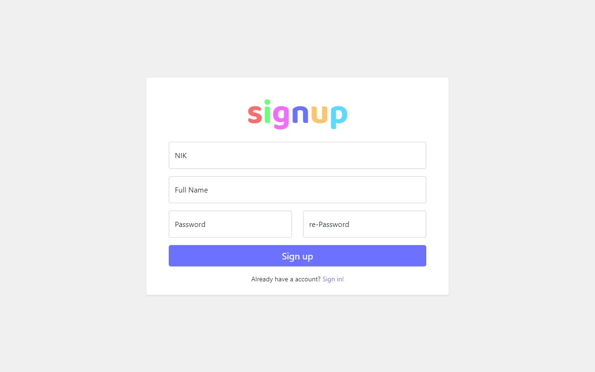
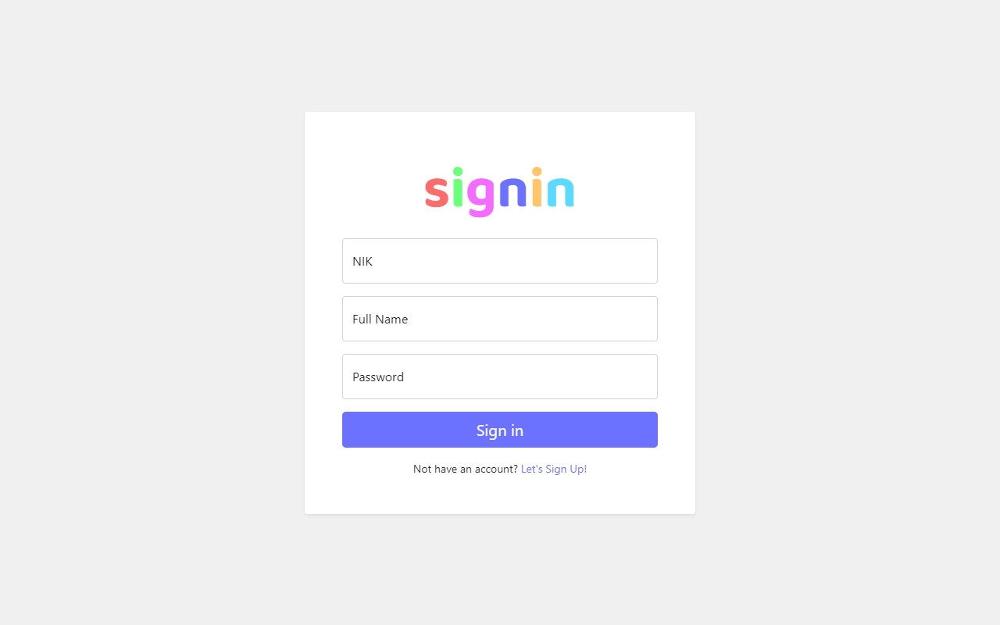
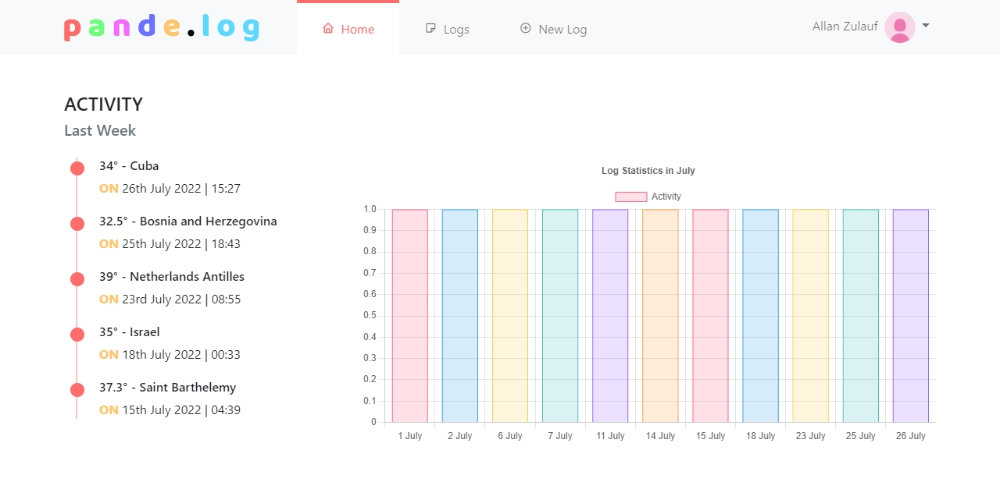
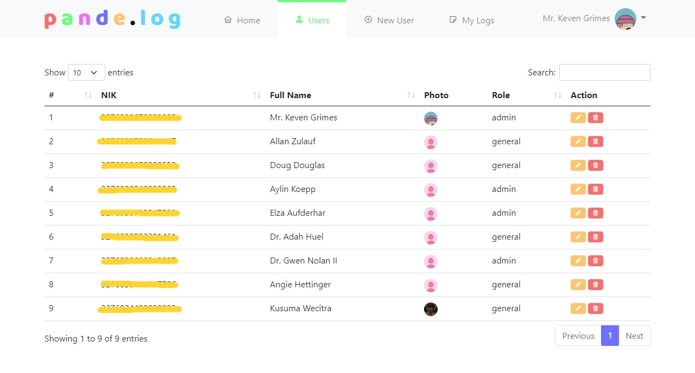
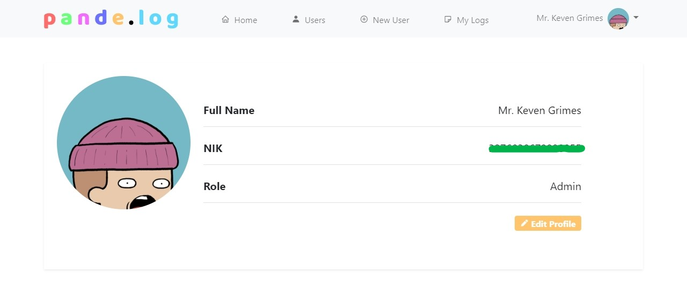
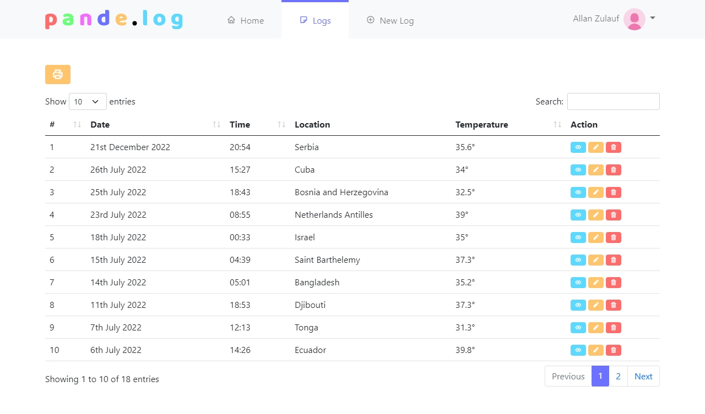
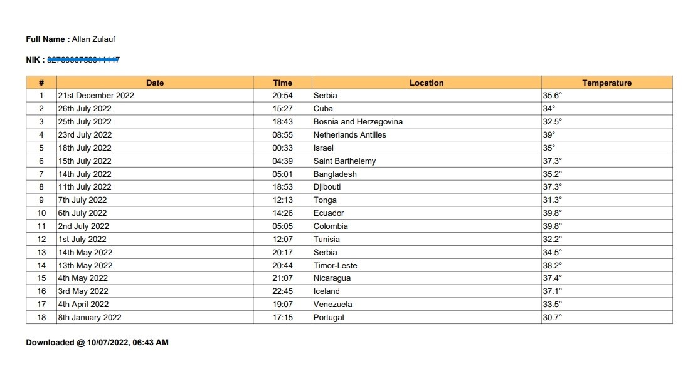

# Aplikasi Catatan Perjalanan PHP

> disclaimer:
> Ini aplikasi bikinnya pake niat (also pake banget)
> ngerjainnya juga sendiri, jadi bisa bebas berselancar. 
> I'll kill some time sambil ngerjain ini by the way :>
> So, this app is very dearest for me

## Teknologi yang digunakan

- [PHP](https://www.php.net/) - Bahasa yang digunakan
- [CodeIgniter](https://codeigniter.com) - Framework PHP
- [Bootstrap](https://getbootstrap.com) - Framework CSS
- [MariaDB/MySQL](https://mariadb.org/) - Database SQL
- [VSCode](https://code.visualstudio.com/) - Text Editor
- [Faker](https://fakerphp.github.io/) - Untuk membuat data palsu
- [BoxIcons](https://boxicons.com/) - Kumpulan ikon yang digunakan
- [DataTables](https://datatables.net/) - Membuat tabel interaksi
- [ChartJS](https://www.chartjs.org/) - Untuk membuat grafik
- [AOS](https://michalsnik.github.io/aos/) - Mengontrol animasi

## Sekilas Info:

1. Terdapat dua user, yaitu `admin` & `general` 
2. Keduanya bisa login pakai NIK 
3. 'CATATAN' dalam aplikasi ini disebut **LOG**

## Fitur

1. Signin/signout user 
2. CRUD log 
3. CRUD user 
4. Edit profile
5. Laporan log export PDF

## Screenshots

### Sign Up

### Sign In

### Dashboard

### Users Management

### Profile

### Logs Management

### Export .pdf

### Sign Out

